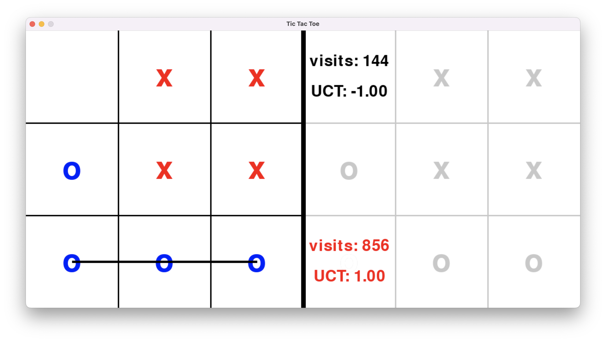
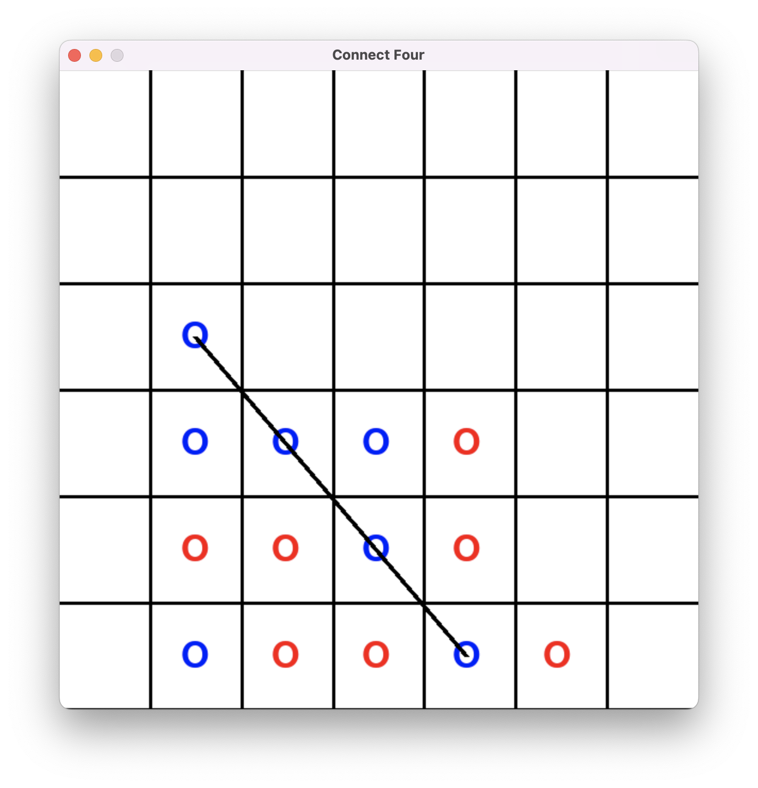
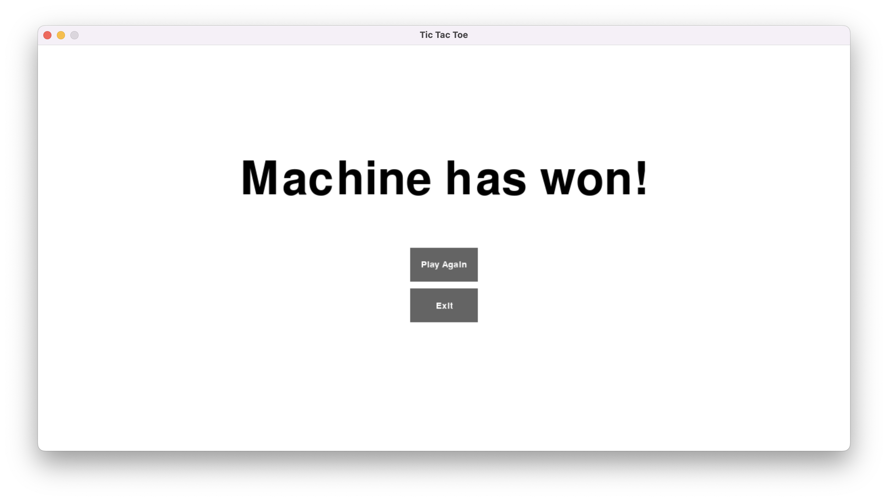

# Board Games with AI

This repository contains implementations of popular board games with AI opponents using the Monte Carlo Tree Search (MCTS) algorithm. The games included are Connect Four and Tic-Tac-Toe. Both graphical versions (using [Pygame](https://github.com/pygame/pygame)) are provided.

## Project Structure

- `connect4_pygame.py`: Graphical Connect Four game.
- `tictactoe_pygame.py`: Graphical Tic-Tac-Toe game.
- `mcts.py`: MCTS algorithm implementation.

## Installation

To run the graphical versions of the games, you need to have Pygame installed. You can install it using pip:

```bash
pip install pygame
```

## Games Included

### Connect Four

- **File**: `connect4_pygame.py`
- **Description**: This is a graphical implementation of Connect Four using the Pygame library.
- **Features**:
  - Interactive game board with Pygame rendering.
  - Player vs AI mode.
  - Win detection and game over notifications.

### Tic-Tac-Toe

- **File**: `tictactoe_pygame.py`
- **Description**: This is a graphical implementation of Tic-Tac-Toe using the Pygame library.
- **Features**:
  - Interactive game board with Pygame rendering.
  - Player vs AI mode.
  - Win detection and game over notifications.

### Monte Carlo Tree Search (MCTS) Algorithm

- **File**: `mcts.py`
- **Description**: This file implements the MCTS algorithm used for AI decision-making in the games.
- **Features**:
  - `Node` class representing a node in the MCTS tree.
  - `MCTS` class managing the MCTS process, including selection, expansion, simulation (rollout), and backpropagation.

## Usage

## Running Connect Four

To run the Connect Four game, execute the following command or run `connect4_pygame.py` using your IDE:

```bash
python connect4_pygame.py
```

## Running Tictactoe

Same thing, execute the following command or run `tictactoe_pygame.py` using your IDE:

```bash
python tictactoe_pygame.py
```

## Screenshots

### Tictactoe vs Machine


### Connect4 vs Machine


### EndGame


## Contributing

Contributions are welcome! Please open an issue or submit a pull request for any improvements or bug fixes.